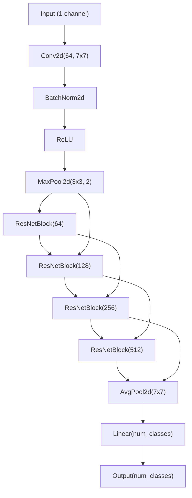

# Circle-Project

> The project is aim to build a model which is able to find the circle inside an image using CNN network

## Files

+ `/circle/*`: the folder include all helper functions
+ `circleDataset.py`: the dataset class for initialize the Datasets for training the model. All training data are generated using the `generate_examples` function with default parameter. The following options are included:
  + `FixCircleDataset(img_size, datasize)`: a list of `datasize` number of data is generated and fixed for training the model
+ `network.py`: the model architecture file. Currently the model is using a ResNet architecture. 
  + `ResNet` is the main model class, the architecture is shown in the figure below
  + `ResNetBlock` is the ResNet block module, the model contain a CNN block with calculating the residual as the output.
+ `trainingloop.py`: the model training loop with real-time result showing in tensorboard
  + `starting_train` is the main training function which used to train the model, input parameter `model` to train the model, evaluation after each epoch is perform and the result will show in tensorboard

## Model Design

+ the model architecture is show here

+ some hyperparameter

|parameter|value|
|--|--|
|optimizer|Adam|
|scheduler|StepLR(LR dacay by 0.5 every 10 epoch)|
|loss function|MSE Loss|
|batch size|64|
|learning rate|0.01|
|epoch|100|
|model init|constant 0|
